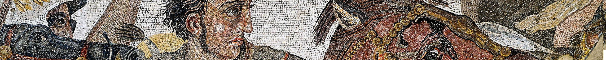

# mosaic

Mosaic is a file format supporting **incremental collaboration on geometric and structured data**. Many files may be combined to form a bigger picture, a composed ECS, but in the composition they **retain their identity and lineage**.

This repository holds the format's specification and the tooling used to work with it:

- **`src/schema`** — the format definition, written in [TypeSpec](https://typespec.io), which emits the
  canonical JSON Schema.
- **`standard`** — the emitted JSON Schema, checked in so consumers can use it without running the toolchain.
- **`src/code-gen`** — a CLI that turns Mosaic component schemas into typed TypeScript or C# classes.
- **`sdk`** — runtime libraries (in progress), the `mosaic` CLI, and `sdk/scenarios`, where what a
  user actually does is written in prose and the test beside it is generated from that.

## The format

A Mosaic dataset is described by an **index file** (`MosaicIndexFile`) with four parts:

| Field | Purpose |
| --- | --- |
| `header` | Format version (`MosaicVersion`). |
| `imports` | Other Mosaic files pulled in by URI, optionally pinned with an `integrity` hash. |
| `componentTables` | External component data — an NDJSON or Parquet file plus the schema of its rows. |
| `sections` | The actual content: provenance plus a list of nodes. |

Each **section** carries a `MosaicProvenanceHeader` — who authored it, when, with which application, and a
message describing the change — followed by the nodes it contributes. Because sections are a list, a dataset
is a history of layered edits rather than a single flat snapshot.

A **node** has a `uuid` id and a list of component references. Each reference names a component `type`
and identifies itself within the node with an `id`. Both remaining fields are optional: `index` points
at a row of that type's table and defaults to `-1`, meaning the reference carries no value at all — a
`core::child` or `core::name` says everything in its `id`, so its type needs no table. `operation`
defaults to `VALUE`:

- `PASS_THROUGH` — leave the inherited value alone
- `DELETE` — unset the value
- `VALUE` — set the value

That three-way operation is what lets a later section modify a node introduced by an earlier one without
restating everything about it. Since `VALUE` is the default, a reference that sets something is written
without an `operation` at all:

```json
{ "type": "core::transform", "id": "transform", "index": 0 }
{ "type": "core::name", "id": "Left plinth" }
{ "type": "core::child", "id": "d6c1d2ba-9376-4461-8c56-27c496c1d2ba" }
{ "type": "core::child", "id": "66666666-6666-4666-8666-666666666666", "operation": "DELETE" }
```

## Generating the schema

```bash
cd src/schema-gen
npm install
npm run compile-json-spec
```

The TypeSpec compiler reads [`mosaic-json-file.tsp`](src/schema-gen/mosaic-json-file.tsp) and writes JSON
Schema to [`standard/`](standard/), as configured in
[`tspconfig.yaml`](src/schema-gen/tspconfig.yaml). Commit the regenerated output alongside the spec change.

## Generating code from component schemas

`mosaic-codegen` walks a directory for `*.schema.json` files and emits a typed class per schema, mirroring
the input directory structure:

```bash
node src/code-gen/mosaic-codegen.js <input_dir> <output_dir> <ts|cs>
```

Every input schema must declare an `x-mosaic-id`, e.g. `"x-mosaic-id": "acme::geometry::wall"`. The
generator uses it to derive the class name (`Wall`), the C# namespace (`acme_geometry_Wall`), and the
`Identity` block it appends to each generated file — which bundles the type ID, the originating schema
source, and the JSON conversion functions so a value can be round-tripped and identified at runtime.

## Packing a dataset

A Mosaic dataset is authored as one JSON document — the index plus the component rows — and packed
into a `.tsr` archive for consumers:

```bash
mosaic pack <input.json> [output.tsr]
```

Packing resolves each `componentTables[].schema` reference (a path relative to the source document)
into the schema document itself, writes one `<type>.ndjson` file per component table, and puts them
alongside `index.json` in the archive. Without an output path the archive is written next to the
source document, so `house-v1.mosaic.json` becomes `house-v1.tsr`.

The source-document format is described in [`sdk/ts/test-data/README.md`](sdk/ts/test-data/README.md),
and the packing itself lives in the TypeScript SDK (`buildMosaicFile`, `packMosaicSource`,
`packMosaicSourceFile`), which the CLI depends on — so the same behaviour is available to any
consumer of the SDK.

## Importing glTF

`mosaic` converts a glTF 2.0 model into Mosaic, reading either a `.gltf` document or a `.glb`
container:

```bash
mosaic gltf      <input.gltf|input.glb> [output.mosaic.json] [--stable-ids]   # to a source document
mosaic gltf-pack <input.gltf|input.glb> [output.tsr]         [--stable-ids]   # straight to an archive
```

Both read the same conversion; the first stops at the editable JSON document, the second packs it in
one step. Buffers are resolved from the GLB binary chunk, from `data:` URIs, or from files beside the
input, and inlined as `data:` URIs so the result stands alone. The component schemas are inlined too,
so a converted `.mosaic.json` packs anywhere without needing the schema files.

`--stable-ids` seeds the node ids from the file name rather than drawing them at random, so
converting the same model twice yields the same ids. That is what lets another document name a node
*inside* an import and keep naming it after the import is rebuilt; without it, re-converting orphans
every reference. Leave it off for a one-off import.

Node names come across as `core::name` components — value-less like `core::child`, with the name
itself in the reference — so the name a person would recognise survives
alongside the uuid a node is identified by. Every glTF id becomes the id of the Mosaic node carrying
the referenced component, so later edits to the component tables cannot silently repoint a
reference. Each buffer, bufferView, accessor, image,
sampler, texture and material gets a node of its own; each glTF node with a mesh becomes a node
carrying that mesh and a `core::transform`. The metallic-roughness surface travels whole — base colour,
metallic-roughness, normal, occlusion and emissive textures, along with `emissiveFactor`,
`alphaMode`, `alphaCutoff` and `doubleSided` — so a textured model keeps its appearance. glTF data
outside the component subset (morph targets, `extensions`, `extras`) is reported as a warning rather
than dropped in silence, and a sparse accessor is refused outright rather than converted into
something wrong.

The conversion lives in the SDK under [`sdk/ts/src/gltf/`](sdk/ts/src/gltf/), which also owns the
glTF-derived component schemas; the CLI commands are a thin wrapper over it.

## Composing a renderable GLB

`mosaic compose` reads an archive together with everything it imports and writes a binary glTF:

```bash
mosaic compose <input.tsr|input.duckdb> [output.glb] [--file <id>]...
```

Imports are resolved relative to the archive that names them, recursively, and merged underneath it
so a later section still wins; an import naming a URI that is not on disk is skipped and reported.
Every Mosaic node in the result becomes a glTF node keeping its id as the node name, and its
components are written one of two ways:

- **Natively**, for the `khronos::gltf` namespace. Meshes and transforms go onto the node itself;
  buffers, bufferViews, accessors, images, samplers, textures and materials are hoisted into the
  document's arrays, and node ids become the array indices glTF expects. Nodes sharing a primitive
  share a mesh.
- **As a transform**, for `core::transform`. Its shape follows the glTF node transform, so it goes
  straight onto the node as a `matrix` or as `translation`/`rotation`/`scale`.
- **As inheritance**, for `core::inherit`, expanded before anything else is read. A node that names
  another with an is-a link receives all of that node's components, except where it carries one under
  the same reference `id` — its own always wins. Several links are allowed, and so are chains; where
  two inherited nodes offer the same `id`, the one named first wins. The is-a links come along with
  the components, so a node two steps down a chain still answers to the type at the top, which is
  what makes "everything that is a Chair" a question about nodes rather than a graph walk. Unlike a
  child link, this changes the node itself, not what hangs beneath it. Inheritance is expanded when
  composing only: the file always records what was written.
- **As hierarchy**, for `core::child`. That component carries no value: the *name* of the reference
  is the id of the child node, so one node can hold many children and a later section can drop a
  single link with a `DELETE` on that name. Composing turns those links into glTF `children`, and a
  node that is someone's child is left out of the scene's root list.
- **As an extension**, for everything else, including `core::name`. The components ride along under `MOSAIC_components` on
  the node, listed in `extensionsUsed` but never in `extensionsRequired`, so a viewer that does not
  know Mosaic still renders the file.

Composing writes **a glTF node per child relation**, so naming the same node from three parents
places it three times. The copies share their mesh, so the geometry is stored once no matter how
often it appears — three helmets come to 32 nodes, one mesh, and the same 3.7 MB binary chunk as one
helmet would. A node placed twice brings its whole subtree along each time. Links that would expand
forever are refused: a cycle is reported with the path that closes it.

Buffers are written as a real binary chunk, not data URIs: every buffer is decoded and laid end to
end into the GLB's BIN chunk on 4-byte boundaries, with each bufferView shifted to match. An image
held inline as a data URI is moved into that chunk too, and given a bufferView of its own, so the
textures ship as bytes rather than as base64 text in the JSON.

Round-tripping `DamagedHelmet.glb` through `gltf-pack` and `compose` returns a file whose materials,
textures, images, samplers, accessors, bufferViews and meshes are all identical to the original, with
byte-identical geometry and texture payloads. The output passes the Khronos glTF validator with no
errors, reporting only the tangent-space warning the original itself carries.

The composition lives in the SDK under [`sdk/ts/src/composition/`](sdk/ts/src/composition/); the CLI
command is a thin wrapper over it.

## Querying a dataset with DuckDB

The TypeScript SDK can load archives into a [DuckDB](https://duckdb.org) database, which turns a set
of Mosaic files into something SQL can be pointed at:

```ts
import { MosaicDatabase } from "mosaic-ts/duckdb";

const db = await MosaicDatabase.open("scene.duckdb");   // creates it if it is not there
await db.insertArchive("house-v2.tsr");
await db.insertArchive("gltf-box.tsr");                  // appends; nothing is overwritten
const rows = await db.all(`SELECT * FROM "khronos::gltf::accessor"`);
await db.close();
```

A fixed set of tables holds the index — `mosaic_file`, `mosaic_import`, `mosaic_section`,
`mosaic_node`, `mosaic_component_ref` and `mosaic_component_table` — and **each component type gets a
table named after it**, built at load time from the schema the archive carries, since which components
a file holds is not known up front:

```sql
SELECT name, count, min FROM "khronos::gltf::accessor" WHERE type = 'VEC3';
```

Columns follow the schema: a string becomes `VARCHAR`, an integer `BIGINT`, an array of numbers
`DOUBLE[]`, and anything with no scalar equivalent stays `JSON`. Every table also keeps `file_id`,
`idx` — the row a reference points at — and `value`, the component exactly as it was stored, so a
nested object is still reachable with `json_extract`. A type whose schema has grown by the time a
later archive arrives gains the new columns; the rows already there read `NULL` for them.

Loading is **pre-composition**: sections are appended as written, so no `DELETE` or `PASS_THROUGH` is
ever applied and inserting the same archive twice keeps both copies, under `name` and `name#2`. A
reference resolves against its own archive, so joins carry `file_id`:

```sql
SELECT w.name
FROM mosaic_component_ref r
JOIN "acme::geometry::wall" w ON w.file_id = r.file_id AND w.idx = r.idx
WHERE r.type = 'acme::geometry::wall';
```

Because a value-less component keeps its data in the reference `id`, names, child links and is-a
links are all queried straight off `mosaic_component_ref` — `WHERE type = 'core::inherit'` answers
"everything that is a Chair" without touching the geometry at all.

[`examples/duckdb-queries.ts`](sdk/ts/examples/duckdb-queries.ts) builds a database from the example
archives and runs ten such queries — the scene tree, is-a links, transforms, following a mesh to its
vertex data, geometry totals per file, and the sections that touched a given node:

```bash
cd sdk/ts && npm run example:duckdb
```

The exporter is a subpath import (`mosaic-ts/duckdb`) rather than part of the main entry point, so
the CLI, which bundles the SDK into a single executable, never pulls DuckDB's native module in.

### Composing a database

`mosaic compose` takes a database wherever it takes an archive:

```bash
mosaic compose scene.duckdb                     # everything in it
mosaic compose scene.duckdb out.glb --file gltf-box --file typed-boxes
```

Reading a database back is the reverse of loading one: each archive kept its own component tables, so
the rows of each type are laid end to end and every reference is shifted to where its archive's rows
begin — the same thing federating two files does. Sections keep the order the archives were inserted
in, so a later archive layers over an earlier one, and nodes that share an id across archives merge
rather than duplicate. What a database has no notion of is an import graph: imports were resolved
into rows on the way in, so insertion order is the layering.

Because DuckDB is a native module and cannot live inside a single-file executable, it is left out of
the build and loaded only when a database is actually named — from the working directory, from beside
the executable, or from wherever `MOSAIC_DUCKDB` points. Every other command runs with nothing
installed, and a database command with nothing to load says exactly what it looked for.

## The HTTP API

[`src/schema/mosaic-api.tsp`](src/schema/mosaic-api.tsp) describes an API for keeping tesserae and their
versions. It emits OpenAPI on its own config, since the file format's emitter has nothing to say
about routes:

```bash
cd src/schema
npm run compile-api-spec     # mosaic-api.tsp -> standard/openapi.json
npm run gen-api-sdk          # openapi.json  -> sdk/ts/src/api/
```

The second step generates three files:

- **`MosaicApiTypes.ts`** — the types, through quicktype, as the file format does it. Object schemas
  are sealed on the way through so each type says exactly what it holds.
- **`MosaicApiRoutes.ts`** — one entry per operation: id, method, path template, path and query
  parameters, whether it takes a body.
- **`MosaicApiClient.ts`** — a `fetch` client with one method per operation, typed from the same
  schemas the server answers with. A non-2xx becomes an `ApiError` carrying the status and the
  server's message; a state the API answers with, such as `OUT_OF_DATE`, comes back as a value.

Client and server are generated from the same document, so a route that moves moves in both at once:

```ts
import { MosaicApiClient } from "mosaic-ts/api";

const client = new MosaicApiClient("http://127.0.0.1:8791");
await client.createTessera({ body: { id, name: "Terrace" } });
const blob = await client.uploadMosaicBlobUrl({ tesseraId: id });
await client.upload({ blobId: blob.blobId, body: archiveBytes });
```

The client is tested against a server that is really listening — a real port, real sockets, real
HTTP — and the server's lifecycle is part of what the tests check: that the port is taken while it
runs, given up when it closes, reusable by the next server, and that a client pointed at a stopped
server fails to connect rather than hanging.

The server routes off that table rather than a hand-written list, so the paths it answers on are the
paths the spec declares, and an operation added to the `.tsp` shows up as a missing handler rather
than as a route nobody noticed. A test asserts every operation has one.

```bash
mosaic serve scene.duckdb --port 8791
```

A **tessera** is one model kept by the API — a tile of the mosaic — and every route is named for it:

```
GET    /Mosaic-api/tesserae
POST   /Mosaic-api/tesserae
GET    /Mosaic-api/tesserae/{tesseraId}
DELETE /Mosaic-api/tesserae/{tesseraId}
POST   /Mosaic-api/tesserae/{tesseraId}/upload-Mosaic-blob-url
POST   /Mosaic-api/tesserae/{tesseraId}/versions
GET    /Mosaic-api/tesserae/{tesseraId}/versions/{versionId}
PUT    /Mosaic-api/tesserae/{tesseraId}/versions/{versionId}/download-Mosaic
PUT    /Mosaic-api/upload/{blobId}
PUT    /Mosaic-api/download/{blobId}
```

Tesserae, versions and blob bookkeeping go in `api_tessera`, `api_tessera_version` and `api_blob`, beside
the tables archives are loaded into — so a version's contents are queryable in the same database it
is served from:

```sql
SELECT file_id, name FROM "acme::geometry::wall";   -- file_id is "<tesseraId>/<versionId>"
```

**Nothing is on disk but the database.** Uploaded bytes are a `BLOB` in `api_blob`, not a file, and
they are the only bytes kept as bytes. `upload-Mosaic-blob-url` hands out an id and a `putURL`, the
client PUTs the archive there, and `POST /versions` reads it *once* — to check it and to unpack it
into the component tables. A version that does not follow the one the tessera is actually on answers
`OUT_OF_DATE`, and a blob that is not a readable archive answers `VALIDATION_ERROR` with the reason,
rather than either being an HTTP error.

**After that, every answer is built from the tables.** A version's content lives in
`mosaic_component_ref` — which node carries which component — and in one table per component type.
Those tables are created when a type is first seen, from the schema the archive carries, since which
components a database will hold is not knowable up front. Downloads and node fetches are assembled
from them and never from the archive a version arrived in, so **dropping every uploaded byte changes
nothing a client can ask for**. One consequence is worth stating plainly: a download is *rebuilt*, so
it equals what was published in content, not byte for byte.

`POST /versions/{versionId}/nodes` fetches **a set of nodes by id**, built when it is asked for and
stored nowhere:

```jsonc
// ?format=glb  or  ?format=tsr
{
  "nodes": ["55555555-…", "66666666-…"],   // the nodes to take
  "componentTypes": ["core::transform"],   // only these; all of them when left out
  "includeChildren": true,                 // and everything beneath them
  "compose": true                          // resolve inheritance, as composing does
}
```

`compose` makes a node that **is-a** something carry that something's components rather than a link
to it. The nodes it inherits from are read for what they hold and then left out of the answer — a
type is a source of components, not a thing to draw beside the thing that is of that type.

**Imports are followed.** A version whose archive imports `bench.tsr` is answered from its own rows
*and* from the tessera published here under the name `bench` — an import names an archive, this server
holds archives as tesserae, and the file name is the link between the two. So a `core::child` that
leaves one tessera and lands on a node in another resolves like any other reference, and the two
datasets stay separately versioned things: the imported tessera is read at its latest version, so
publishing a new bench changes every courtyard that places one, without republishing any of them. The
imported archive layers *underneath* the one that imports it, as an older section would. An import
naming something this server does not have is left out and reported rather than failing the request.

**The subset is taken in the database, not by rebuilding the version and filtering it.** The nodes
asked for, the references they carry and the rows behind those are each queried by name; collapsing —
the last write to a reference wins, a `DELETE` removes it — is done in SQL, and `includeChildren`
walks `core::child` with a recursive CTE that touches nothing else. So the cost follows the request
rather than the size of the version:

| version | rebuild then filter | selected in SQL |
| --- | --- | --- |
| 406 nodes | 26 ms | 19 ms |
| 1606 nodes | 46 ms | 21 ms |
| 6006 nodes | 127 ms | 22 ms |

The answer is a stream of bytes: a `.glb` for a viewer, or a `.tsr` that is a Mosaic archive in its
own right — one that can be published again as another tessera. Either way the subset is made whole
first: anything a kept component points at comes along, so a mesh never names an accessor the answer
does not carry. The component filter applies to the nodes that were asked for, not to what was pulled
in for them. Nodes the version does not have are named in an `x-mosaic-missing` header, and the number
built in `x-mosaic-nodes`, so the body stays nothing but the file.

`download-Mosaic` builds what the `downloadType` asks for and answers with a blob url:
`just_this_version` hands back the archive as uploaded, `whole_tessera_history_intact` federates every
version up to that one keeping all sections, and the condensed forms collapse them to what is still
leading.

### The page it serves

`mosaic serve` also puts a page at `/` for looking at what the server holds:

```bash
mosaic serve scene.duckdb --port 8791     # then open http://127.0.0.1:8791
```

Drop `.tsr` files on it and they are published — a new tessera, or a new version of one with that
name. Then four panels:

- a **tesserae** list of everything the server holds. Tick as many as you like and pick a version of
  each; what is ticked is what is on show, all of it read as one scene;
- a **tree** of the child hierarchy, grouped by the versions on show and drawn from a single
  selection over their root nodes, each node labelled by its `core::name`;
- a **components** view of whatever node is selected, with each component's type, reference id and
  value, and the tessera the node is written in;
- a **3D** view, which is [`<model-viewer>`](https://modelviewer.dev) — a viewer that already knows
  PBR materials, textures and image-based lighting — fed the GLB that
  `POST …/versions/{versionId}/nodes?format=glb` builds for the selected node. Selecting a node
  reloads it; **Show everything** loads every root on show.

**This is where imports are worth looking at.** Tick a tessera that imports another and the one it
imports is read too, ticked or not — it is listed as *via import*, and any of its nodes drawn in the
tree carries a badge naming it, so a child link crossing from one tessera into another is visible as
exactly that. Being a root is judged across everything on show, so ticking both a courtyard and the
bench it places moves the bench out of its own list of roots and under the spot that holds it, rather
than drawing it twice.

A **compose** checkbox runs both the tree and the 3D view through the flag above, so the difference
between a node that is-a type and a node carrying that type's geometry is one click.

The page's own endpoints — `/app/upload`, `/app/tesserae`, `/app/scene` and `/app/glb` — are
deliberately **not** part of the spec: `mosaic-api.tsp` is the contract, and these exist so the page
can upload in one call, read a whole scene in another, and ask for one view over *several* versions,
which is a question the spec's per-version `nodes` operation does not express. Selecting a single
node still goes through that real endpoint — against the version the node is written in, which for a
node reached across an import is the imported tessera. `<model-viewer>` is loaded from a CDN, so the
3D panel wants the machine to have internet; the rest of the page does not.

Two things to know. **The query API is not implemented** — it answers 501, deliberately, and is the
one operation with no real handler. And DuckDB takes an exclusive lock on the database file, so
`mosaic compose scene.duckdb` will not run while a server is holding it; stop the server first.

## Tests

The TypeScript SDK is tested end to end: each case builds a real `.mosaic` archive from an example
dataset, reads it back through `LoadMosaicFile`, and asserts on what a reader sees.

```bash
cd sdk/ts
npm install
npm test
```

The runner is Node's built-in `node:test` with native TypeScript execution, so there is no test
framework or build step to configure. Example datasets live in [`sdk/ts/test-data/`](sdk/ts/test-data/)
and are documented in the README there.

## Scenarios

[`sdk/scenarios/`](sdk/scenarios/) describes, in prose, things a user of Mosaic actually does — and
holds the tests generated from those descriptions. One folder per scenario: the Markdown is the
source, and `<name>.test.ts` beside it mirrors the prose step for step, with each `Given` / `When` /
`Then` as the comment above the code that carries it out.

They run for real. Every scenario gets a temporary folder and, when it asks for one, a server
listening on a free port; both are cleaned up afterwards, whether it passed or not.

```bash
cd sdk/scenarios
npm install
npm test
```

[publish-a-tessera](sdk/scenarios/publish-a-tessera/publish-a-tessera.md) writes a source document to
disk, packs it into an archive, publishes it through the API as a tessera's first version, downloads
it back byte for byte, composes it into a `.glb`, and checks that a second version claiming to follow
nothing is answered with `OUT_OF_DATE`.

[fetch-some-nodes](sdk/scenarios/fetch-some-nodes/fetch-some-nodes.md) publishes a tessera and then
takes pieces of it: one node as a `.glb`, the same node as a `.tsr` that is published again as
another tessera, a node narrowed to one component type, and a parent with everything beneath it.

## Status

Mosaic is pre-1.0. Expect breaking changes to
both the schema and the generated code layout.
